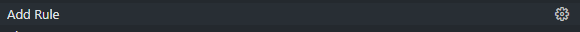
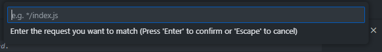
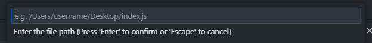
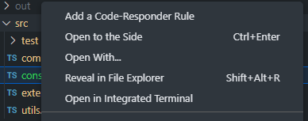
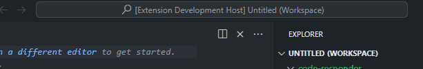
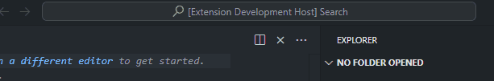

# code-responder

code-responder allows you to return files from your local disk instead of transmitting the request to the server - directly from vscode.

## Features

### Add Rules

Add a rule with the Command Palette (Ctrl+Shift+P).

Enter the request you would like to intercept. Regex is supported.

Then enter the file path to the file you'd like to serve.

You can alse add rules by right clicking on the file you want to serve and select "Add a Code-Responder Rule". You will then be prompted to enter the request.

### View Rules

View rules by selecting "View Rules" in the Command Palette.

You can delete rules from here by clicking the trash icon on the right.

### Change Browser

The default browser is set to msedge but you can switch to chrome by selecting "Change Browser" in the Command Palette.

### Start Capturing

Once you're satisfied with your rules select "Start Capturing" from the Command Palette to start the proxy server and a fresh browser. If you forget a rule, don't fret, just add the rule and the server will load the new rule.

### Stop Capturing

Once you've finished your testing you can stop the server by selecting "Stop Capturing" from the Command Palette.

## Settings

### coderesponder.proxyPort

The default port the server will run on is 8000. You can change this port with the setting 'coderesponder.proxyPort'.

### codeResponder.profileDestination

The default storage destination for the browser profile is C:\\code-responder-profile-{browser}. You can change the destination with the setting 'coderesponder.profileDestination'.

## Release Notes

### 1.0.0

Initial release of code-responder